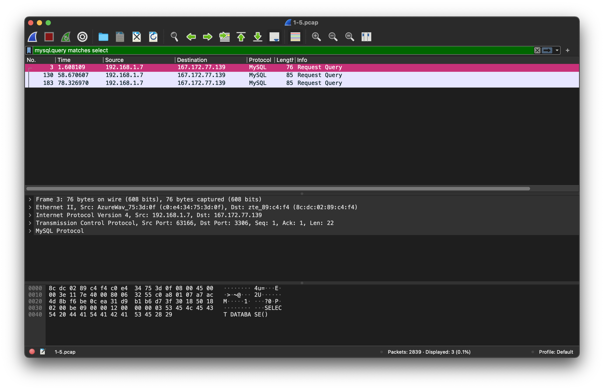
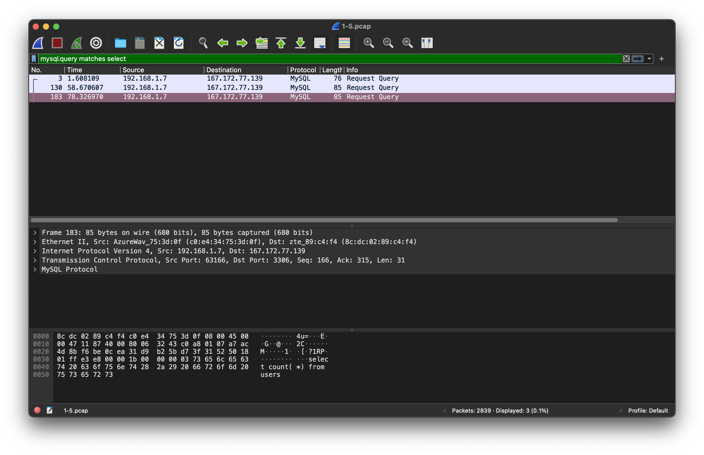

# Jarkom-Modul-1-C08-2021

Berikut adalah laporan resmi Praktikum Jaringan Komputer Modul 1 tahun 2021

Anggota Kelompok C08 :
* 05111940000100 - Muhammad Raihan
* 05111940000208 - Inez Yulia Amanda
* 05111940000209 - Refaldyka Galuh Pratama

## 1. Sebutkan webserver yang digunakan pada "ichimarumaru.tech"! 
- Display filter dengan syntax `http.host == ichimarumaru.tech`

- Klik kanan dan klik follow lalu pilih TCP stream
- Web server yang digunakan adalah nginx/1.18.0 (Ubuntu)

## 2. Temukan paket dari web-web yang menggunakan basic authentication method!
Gunakan syntax filter `http.authbasic` maka diperoleh hasil berikut :

## 3. Ikuti perintah di basic.ichimarumaru.tech! Username dan password bisa didapatkan dari file .pcapng!
- Gunakan syntax filter `http.host contains "basic.ichimarumaru.tech"` pada file `.pcapng` yang telah didownload untuk nomor 1-5.
- Akan terdapat beberapa paket berprotokol `HTTP`.
- Didalam salah satu paket tersebut terdapat basic authorization yang didalamnya terdapat username dan password.
- Gunakan username dan password untuk login ke `basic.ichimarumaru.tech`
- Isi jawaban urutan konfigurasi pengkabelan `T568A`

## 4. Temukan paket mysql yang mengandung perintah query select!
Gunakan filter `tcp.port == 3306` karena port default NySQL adalah 3306

## 5. Login ke portal.ichimarumaru.tech kemudian ikuti perintahnya! Username dan password bisa didapat dari query insert pada table users dari file .pcap!
- Gunakan syntax filter `mysql contains username && mysql contains password`
- Akan terdapat satu hasil paket berprotokol `MySQL`
- Buka Paket tersebut akan terdapat query username dan password yang sama dengan yang diminta soal
- Gunakan username dan password untuk login ke `portal.ichimarumaru.tech`
- Isi jawaban urutan konfigurasi pengkabelan `T568B`

## 6. Cari username dan password ketika melakukan login ke FTP Server!

## 7. Ada 500 file zip yang disimpan ke FTP Server dengan nama 0.zip, 1.zip, 2.zip, ..., 499.zip. Simpan dan Buka file pdf tersebut. (Hint = nama pdf-nya "Real.pdf")
- Gunakan syntax filter `frame contains Real.pdf`
- Akan terdapat paket yang berprotokol `FTP-DATA`
- klik kanan salah satu paket dan kemudian follow TCP Stream

- Pilih untuk menampilkan data dalam `Raw`
-
- Kemudian save as `Real.pdf`

- Jika berhasil, File tersebut jika dibuka akan terdapat tulisan `YOU FOUND ME`

## 8. Cari paket yang menunjukan pengambilan file dari FTP tersebut!

## 9. Dari paket-paket yang menuju FTP terdapat inidkasi penyimpanan beberapa file. Salah satunya adalah sebuah file berisi data rahasia dengan nama "secret.zip". Simpan dan buka file tersebut!

## 10. Selain itu terdapat "history.txt" yang kemungkinan berisi history bash server tersebut! Gunakan isi dari "history.txt" untuk menemukan password untuk membuka file rahasia yang ada di "secret.zip"!

## 11. Filter sehingga wireshark hanya mengambil paket yang berasal dari port 80! 

## 12. Filter sehingga wireshark hanya mengambil paket yang mengandung port 21!

## 13. Filter sehingga wireshark hanya menampilkan paket yang menuju port 443! Gunakan perintah capture filter dst port 443
Gunakan syntax `dst port 443` untuk mendapakan paket menuju port 443

sehingga diperoleh

## 14. Filter sehingga wireshark hanya mengambil paket yang tujuannya ke kemenag.go.id!Gunakan perintah capture filter dst host kemenag.go.id
Gunakan capture filter dengan syntax `dst host kemenag.go.id`

dengan hasil berikut dimana semua destination menuju IP address yang sama

## 15. Filter sehingga wireshark hanya mengambil paket yang berasal dari ip kalian!
